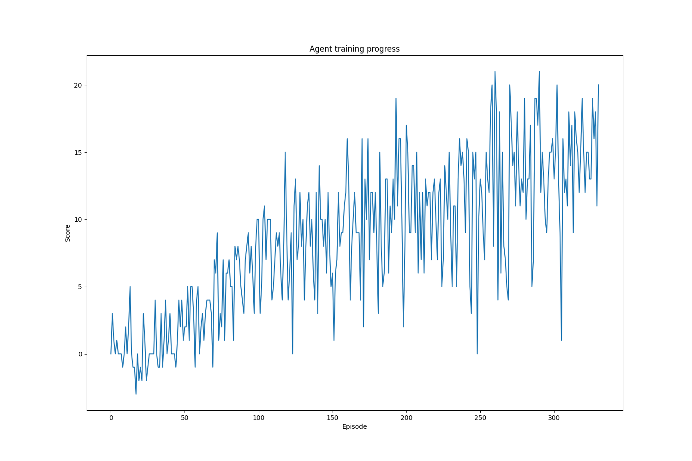

# Deep Reinforcement Learning - P1 Banana Navigation

## Overview

Deep reinforcement learning was applied to the Banana-collecting unity environment and variants of [Double Deep Q](https://arxiv.org/pdf/1509.06461.pdf) agents were able to solve the game (defined as an average score above 13.0 over 100 episodes).

## Architectures

The base architecture employed was a Double Deep Q (DDQ) agent with an experience replay, with soft updating weights between the network and target network. A DDQ agent employs two neural networks, named the local and the target network. The purpose of the local network is to select greedy actions for the agent to follow with 1-epsilon chance. The local network is trained by minimising the loss between the predicted state-action pairs and the observed reward plus discounted next state value from the target network. Occasionally, the target network is updated via a soft update, which partially copies the weights of the local network to the target network. The use of two networks is to decouple selection from evaluation, whereas a single network can lead to overestimation of state-action values.

In order to be able to soft copy weights, the same architecture must be used for both networks. Since this was not a visual task, a fully connected network was chosen. Between each hidden layer, a leaky ReLU activation function was chosen to give non-linearity and not suffer vanishing gradients (such as sigmoid activations) or suffer the dying ReLU problem. The number of hidden layers and neurons per layer was left configurable, with default values described below, and the input and output sizes of the networks were inferred from the environment. For training, the Adam optimiser was used with a configurable learning rate.

A [prioritised experience replay](https://arxiv.org/pdf/1511.05952.pdf) with adaptive priority strength was also implemented in order for the agent to learn from its larger mistakes more often, potentially converging faster than uniformly sampling experiences.

## Hyperparameters

The `epsilon_decay` controls the rate at which epsilon (the chance of randomly selecting an action) decays with respect to the number of frames seen. The `min_epsilon` parameter is the minimum value that epsilon can take. The default values

```
epsilon_decay=0.99995
min_epsilon=0.01
```

were selected s.t. epsilon decays by 0.985 per episode (0.99995 ^ 300). This means epsilon reaches the minimum value of 0.01 after 307 episodes, approx the training time, and begins to make mostly deterministic decisions.

The following parameters were set by using common values found online, where `fc_layers` specifies two hidden layers with size 64 each as default. This configuration was chosen as a reasonable balance of capturing non-linearity and keeping the network from being overly complex. Changing the network architecture was not explored, however in this framework it would be easy to optimise like any other hyperparameter by just changing the config and not any code.

```
buffer_size=8192
batch_size=64
gamma=0.99
tau=1e-3
lr=5e-4
update_every=4
fc_layers=64,64
```

Finally, the `prioritised_strength` controlled the strength of priority (loss between expected Q and target Q to the power of the strength, as per the [original paper](https://arxiv.org/pdf/1511.05952.pdf)) in picking experiences to learn from. The value was set as 0.5 because it was found that a value of 1 gave poor performance, perhaps because it learnt too often from the same examples and because 0 is the uniform case. 

## Results

The uniform and prioritised experience replay Deep Q agents were each trained once using the default parameters until they reached an average score of 13.0 across 100 episodes. The training progresses of each are shown below.


The uniform experience replay Deep Q agent took 331 episodes to solve the environment.


The prioritised experience replay Deep Q agent (`priority_strength=0.5`) took 347 episodes to solve the environment.

These results suggest that the priority replay does not help, however, it is much more likely this is just down to chance as a different random seed may yield different results. Furthermore, the priority replay introduces another parameter that was not optimised. Both agents training times are an upper estimate of how long they took since they were evaluated on-the-fly based on the scores of the past 100 training episodes. A lower estimate would be to evaluate across 100 episodes after the completion of each training episode, however this would be computationally expensive.

The model weights from the trained agents were placed in the path `agents/checkpoints`.

## Future Improvements

Solving this environment could be improved with the following

- Perform hyperparameter optimisation
- Perform stability analysis of training using different random seeds
- Implement a [dueling DDQN](https://arxiv.org/pdf/1511.06581.pdf)
- Implement a [distributional DQN](https://arxiv.org/pdf/1707.06887.pdf)
- Implement a [noisy DQN](https://arxiv.org/pdf/1706.10295.pdf)
- Implement a [rainbow network](https://arxiv.org/pdf/1710.02298.pdf)
- Learn from the raw screen pixels